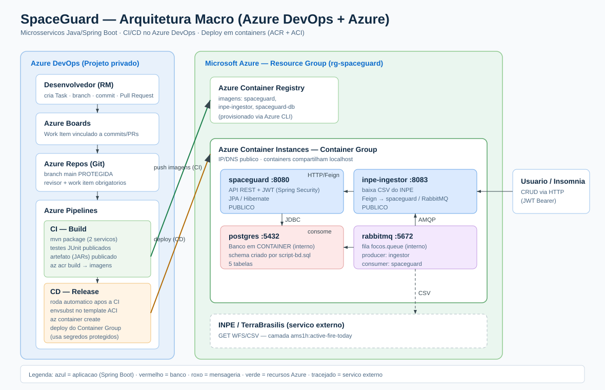

# SpaceGuard — Monitoramento de Queimadas (Microsserviços)

Projeto composto por **dois microsserviços Java/Spring Boot** que, juntos, coletam
focos de incêndio em tempo real do **INPE** e os persistem no banco da aplicação
**SpaceGuard**. A comunicação entre os serviços é feita com **Spring Cloud OpenFeign**.

```
                         (1) baixa CSV de focos ativos (HTTP/Feign)
                ┌──────────────────────────────────────────────┐
                │                                                ▼
        ┌───────────────────┐                       ┌────────────────────────┐
        │   inpe-ingestor   │                        │   INPE / TerraBrasilis │
        │   (porta 8083)    │                        │   (WFS / GeoServer)    │
        │                   │                        └────────────────────────┘
        │  - baixa o CSV    │
        │  - parseia        │
        │  - estima valores │   (2) POST /auth/login  ┌────────────────────────┐
        │  - cria Risco     │ ──────────────────────▶ │   spaceguard (API)     │
        │  - envia Focos    │   (3) POST /risco       │   (porta 8080)         │
        │                   │   (4) POST /foco-incendio│  + JWT (Spring Security)│
        │  [FeignClients]   │ ──────────────────────▶ │  + JPA / Hibernate     │
        └───────────────────┘   (com Bearer token)    └───────────┬────────────┘
                                                                   │
                                                                   ▼
                                                       ┌────────────────────────┐
                                                       │  PostgreSQL (Azure)    │
                                                       └────────────────────────┘
```

---

## Sumário

- [Os dois serviços](#os-dois-serviços)
- [Como eles conversam (Feign + JWT)](#como-eles-conversam-feign--jwt)
- [Fluxo da importação (passo a passo)](#fluxo-da-importação-passo-a-passo)
- [De onde vêm os dados e o que é estimado](#de-onde-vêm-os-dados-e-o-que-é-estimado)
- [Como rodar](#como-rodar)
- [Endpoints principais](#endpoints-principais)
- [Configuração](#configuração)
- [Testando pelo Insomnia](#testando-pelo-insomnia)

---

## Os dois serviços

| Serviço | Pasta | Porta | Papel |
|---|---|---|---|
| **spaceguard** | [`spaceguard/`](spaceguard) | 8080 | API REST com CRUDs (Usuário, Risco, Foco de Incêndio, Alerta, Local). Autenticação JWT. Persiste em PostgreSQL. |
| **inpe-ingestor** | [`inpe-ingestor/`](inpe-ingestor) | 8083 | Microsserviço de ingestão. Baixa o CSV do INPE, transforma e envia para o spaceguard via Feign. **Não tem banco próprio.** |

> A separação é proposital: o `inpe-ingestor` é só "baixador de CSV + cliente HTTP".
> Quem fala com o banco é exclusivamente o `spaceguard`. Eles só se comunicam por HTTP,
> então podem evoluir de forma independente.

Stack: **Java 21**, **Spring Boot 4.0.6**, **Spring Cloud 2025.1.x (OpenFeign 5)**,
PostgreSQL, Apache Commons CSV.

---

## Como eles conversam (Feign + JWT)

Toda chamada do `inpe-ingestor` para o `spaceguard` é feita por **FeignClients**
(interfaces declarativas que viram chamadas HTTP):

- `AuthClient`  → `POST /auth/login` — **sem** token (é ele quem gera o token).
- `RiscoClient` → `POST /risco` — **com** token.
- `FocoClient`  → `POST /foco-incendio` — **com** token.
- `InpeClient`  → `GET` no WFS do INPE — serviço externo, sem token.

A autenticação funciona assim:

1. O `TokenProvider` faz **login uma única vez** e guarda o JWT em memória.
2. Um **interceptor global** (`FeignAuthConfig`) injeta o header
   `Authorization: Bearer <token>` **somente** nas rotas protegidas do spaceguard
   (`/risco` e `/foco-incendio`) — nunca no `/auth/login` nem no INPE.

---

## Fluxo da importação (passo a passo)

Disparado por **`POST http://localhost:8083/importar`**:

1. **Baixa** o CSV de focos ativos do dia no INPE (camada `ams1h:active-fire-today`),
   ordenado por horário decrescente, pegando os **N mais recentes** (`max-features`).
2. **Parseia** o CSV (Commons CSV) lendo `geom`, `view_date`, `viewed_at`, `biome`, `municipio`.
3. **Estima** `frp`/`brightness`/`confidence` por foco (heurística — ver abaixo).
4. **Cria um Risco por bioma** no spaceguard (`POST /risco`) e guarda o `idRisco`.
5. **Envia cada foco** (`POST /foco-incendio`) com o `idRisco` do seu bioma.
6. Devolve um resumo: `{ focosEnviados, focosIgnorados, riscosPorBioma }`.

---

## De onde vêm os dados e o que é estimado

Fonte: **INPE / TerraBrasilis (WFS)** — a mesma usada pelo app Python do projeto IoT:

```
https://terrabrasilis.dpi.inpe.br/geoserver/ams1h/ows
  ?service=WFS&version=1.0.0&request=GetFeature
  &typeName=ams1h:active-fire-today&outputFormat=csv
  &maxFeatures=20&sortBy=viewed_at D
```

Colunas reais do CSV: `FID, id, view_date, viewed_at, satelite, municipio, geom, biome`.

Mapeamento para o `FocoIncendioRequest`:

| Campo no spaceguard | Origem | Observação |
|---|---|---|
| `longitude` | `geom` (1º número) | WKT `POINT (lon lat)` |
| `latitude`  | `geom` (2º número) | **lon vem antes de lat** |
| `dataDeteccao` | `view_date` | data do dia |
| `bioma` | `biome` | ex.: "Amazônia" |
| `municipio` | `municipio` | — |
| `focoAtivo` | — | sempre `true` (camada "active") |
| `estado` | — | **não existe no CSV** → `null` |
| `riscoFogo` | estimado | `confidence / 100` (faixa 0–1) |
| `idRisco` | criado por bioma | via `POST /risco` |

**O que é estimado** (`EstimadorService`): o CSV não traz nível de risco nem FRP.
Replicamos a heurística do projeto Python (peso de FRP por bioma + sazonalidade da
estação seca) para gerar `frp`/`brightness`/`confidence`. O **nível de risco** do
Risco é derivado do bioma:

- Pantanal / Cerrado → **ALTO**
- Amazônia / Caatinga → **MEDIO**
- Mata Atlântica / Pampa → **BAIXO**

> ⚠️ A heurística usa aleatoriedade (como o original), então `frp`/`riscoFogo`
> variam a cada execução. Não há deduplicação: rodar `/importar` 2x insere os
> focos novamente.

---

## Como rodar

### Pré-requisitos
- **Java 21+** e **Maven** (os projetos têm `mvnw`, então o Maven instalado é opcional).
- Um **PostgreSQL** acessível (no projeto, hospedado na Azure) com o schema do spaceguard.

### 1. Configurar o `.env` de cada serviço

**`spaceguard/.env`** (credenciais do banco e JWT):
```env
DB_URL=jdbc:postgresql://<host>:5432/<database>
DB_USERNAME=<usuario>
DB_PASSWORD=<senha>
JWT_SECRET=<segredo-base64>
```

**`inpe-ingestor/.env`** (como falar com o spaceguard):
```env
SPACEGUARD_URL=http://localhost:8080
SPACEGUARD_USER=seu-email@exemplo.com
SPACEGUARD_PASS=sua-senha
```

> O usuário acima precisa **existir** no spaceguard (registre via `POST /auth/register`).

### 2. Subir o spaceguard (porta 8080)
```bash
cd spaceguard
./mvnw spring-boot:run        # Windows: .\mvnw.cmd spring-boot:run
```

### 3. Subir o inpe-ingestor (porta 8083)
> Rode **de dentro** da pasta `inpe-ingestor` para o `.env` ser carregado.
```bash
cd inpe-ingestor
./mvnw spring-boot:run        # Windows: .\mvnw.cmd spring-boot:run
```

### 4. Disparar a importação
```bash
curl -X POST http://localhost:8083/importar
# PowerShell:
# Invoke-RestMethod -Method Post -Uri http://localhost:8083/importar
```
Resposta esperada:
```json
{ "focosEnviados": 20, "focosIgnorados": 0, "riscosPorBioma": { "Amazônia": "...", "Cerrado": "..." } }
```

---

## Endpoints principais

### inpe-ingestor (8083)
| Método | Rota | Descrição |
|---|---|---|
| POST | `/importar` | Executa a ingestão completa do INPE → spaceguard. |

### spaceguard (8080)
| Método | Rota | Auth |
|---|---|---|
| POST | `/auth/register` | público |
| POST | `/auth/login` | público (retorna `{ token }`) |
| GET/POST/PUT/DELETE | `/risco`, `/risco/{id}` | JWT |
| GET/POST/PUT/DELETE | `/foco-incendio`, `/foco-incendio/{id}` | JWT |
| GET/POST/PUT/DELETE | `/alerta`, `/alerta/{id}` | JWT |
| GET/POST/DELETE | `/local-usuario/...` | JWT |
| GET | `/swagger-ui.html` | público |

---

## Configuração

Principais chaves do `inpe-ingestor/src/main/resources/application.yaml`:

| Chave | Padrão | O que faz |
|---|---|---|
| `server.port` | `8083` | Porta do ingestor. |
| `spaceguard.base-url` | `http://localhost:8080` | URL da API spaceguard. |
| `spaceguard.usuario` / `senha` | do `.env` | Credenciais usadas no login. |
| `inpe.base-url` | TerraBrasilis | Servidor do INPE. |
| `inpe.type-name` | `ams1h:active-fire-today` | Camada de focos do dia. |
| `inpe.max-features` | `20` | Quantos focos (mais recentes) importar. |
| `spring.cloud.openfeign.client.config.inpe.readTimeout` | `15000` | Timeout do download do INPE (ms). |

Para importar mais/menos focos, basta mudar `inpe.max-features` e reiniciar.

---

## Testando pelo Insomnia

Importe o arquivo [`spaceguard/SpaceGuard-Insomnia.json`](spaceguard/SpaceGuard-Insomnia.json).
Ele já vem com:
- Pastas para Auth, Risco, Foco, Alerta, Local Usuário e o **Ingestor**.
- Ambiente com `base_url` (8080), `ingestor_url` (8083) e `token`.
- Bearer automático (`{{ token }}`) nas rotas protegidas.

Fluxo: **Registrar Usuário → Login** (copie o `token` para a variável de ambiente) →
demais requisições. Para a ingestão: **06 → Importar focos do INPE**.

---

## Deploy em Nuvem (DevOps — Azure)

A solução é publicada **100% em nuvem** usando **Azure DevOps** (Boards, Repos,
Pipelines) e **Azure** (ACR + ACI). Toda a infraestrutura é provisionada por
**scripts Azure CLI**.

### Desenho da arquitetura


Tudo roda como **containers** num único **Container Group (ACI)**, com as imagens
guardadas no **Azure Container Registry (ACR)**. Como os containers do grupo
compartilham `localhost`, a comunicação interna (app→banco, app→fila,
ingestor→app) funciona igual ao ambiente local:

| Container | Porta | Exposição | Papel |
|---|---|---|---|
| `spaceguard` | 8080 | pública | API REST + JWT |
| `inpe-ingestor` | 8083 | pública | ingestão do INPE |
| `postgres` | 5432 | interna | banco (schema via `script-bd.sql`) |
| `rabbitmq` | 5672 | interna | fila `focos.queue` |

### Estrutura de arquivos DevOps
| Caminho | Conteúdo |
|---|---|
| `scripts/script-infra-*.sh` | provisionamento via Azure CLI |
| `scripts/script-bd.sql` | DDL das 5 tabelas |
| `scripts/aci-deployment.template.yaml` | definição do Container Group |
| `dockerfiles/*.Dockerfile` | imagens de spaceguard, inpe-ingestor e postgres |
| `azure-pipeline.yml` | pipeline CI (build/testes/imagens) + CD (deploy) |
| `crud-json/` | corpos JSON para os CRUDs |
| `docs/GUIA-AZURE-DEVOPS.md` | passo a passo da entrega + roteiro do vídeo |

### Como provisionar (resumo)
```bash
az login
bash scripts/script-infra-01-base.sh      # Resource Group + ACR
# o deploy do app é feito automaticamente pela pipeline de Release,
# ou manualmente:
export DB_PASSWORD=...  JWT_SECRET=...  SPACEGUARD_PASS=...
bash scripts/script-infra-02-deploy.sh
```

> Passo a passo completo (Boards, branch protegida, convite do professor,
> Service Connection, variáveis secretas e roteiro do vídeo) em
> [`docs/GUIA-AZURE-DEVOPS.md`](docs/GUIA-AZURE-DEVOPS.md).

### Segurança / variáveis de ambiente
Nenhum segredo é versionado. Os `.env` estão no `.gitignore` e o `application.yaml`
**não** tem segredos hardcoded (`DB_PASSWORD` e `JWT_SECRET` vêm só de variável de
ambiente). Na nuvem, os segredos vêm do **Variable Group** `spaceguard-secrets` do
Azure DevOps e são injetados como *secure environment variables* no ACI.

---

## CRUD em JSON (operações por tabela)

Bodies prontos em [`crud-json/`](crud-json/). O CRUD é demonstrado em duas tabelas:
**`risco`** e **`foco_incendio`** (foco depende de um risco).

### Autenticação (obter o token)
```http
POST /auth/register        # body: crud-json/00-auth-register.json
POST /auth/login           # body: crud-json/01-auth-login.json  -> retorna { "token": "..." }
```
Use o token nas demais chamadas: header `Authorization: Bearer <token>`.

### Tabela `risco`
```http
POST   /risco              # CREATE  -> body: crud-json/risco-create.json
GET    /risco              # READ    (lista)   |   GET /risco/{id}  (um)
PUT    /risco/{id}         # UPDATE  -> body: crud-json/risco-update.json
DELETE /risco/{id}         # DELETE
```
```json
// CREATE  (crud-json/risco-create.json)
{ "nivelRisco": "ALTO", "pontuacao": 65.0 }
// UPDATE  (crud-json/risco-update.json)
{ "nivelRisco": "MEDIO", "pontuacao": 42.5 }
```

### Tabela `foco_incendio`
```http
POST   /foco-incendio      # CREATE  -> body: crud-json/foco-create.json (use o idRisco criado acima)
GET    /foco-incendio      # READ    (lista)   |   GET /foco-incendio/{id} (um)
PUT    /foco-incendio/{id} # UPDATE  -> body: crud-json/foco-update.json
DELETE /foco-incendio/{id} # DELETE
```
```json
// CREATE  (crud-json/foco-create.json)
{
  "latitude": -3.465305, "longitude": -62.215649, "dataDeteccao": "2026-06-07",
  "riscoFogo": 0.87, "bioma": "Amazônia", "municipio": "Manaus", "estado": "AM",
  "focoAtivo": true, "idRisco": "COLE_AQUI_O_ID_DO_RISCO_CRIADO"
}
```

> No vídeo, **comprove a persistência com `SELECT` direto no banco** (não use GET):
> `SELECT * FROM risco;` e `SELECT * FROM foco_incendio;`
